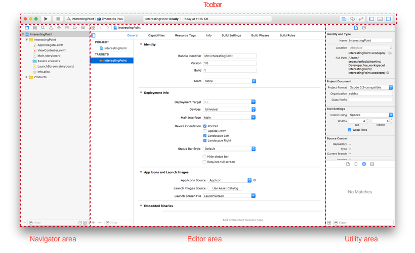
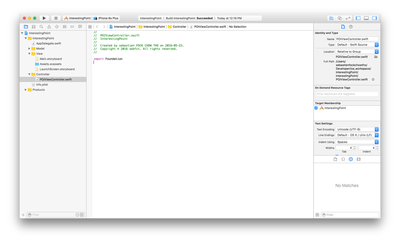
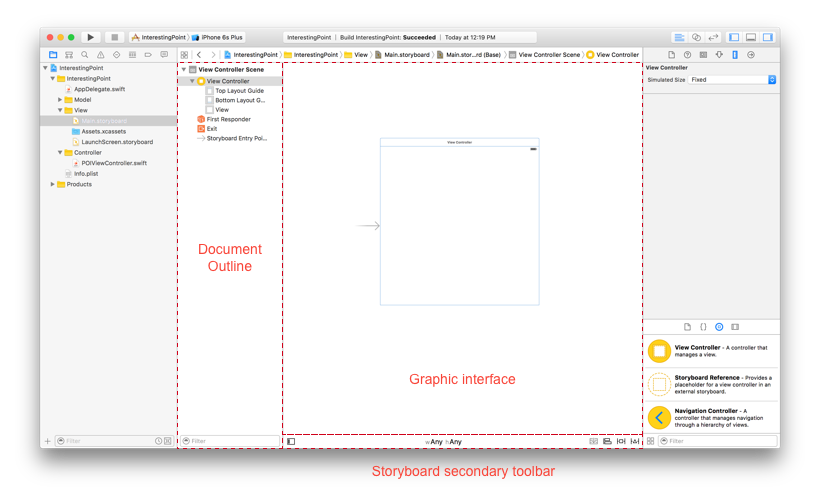
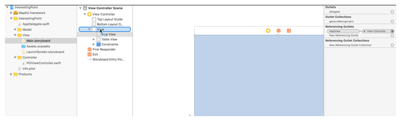
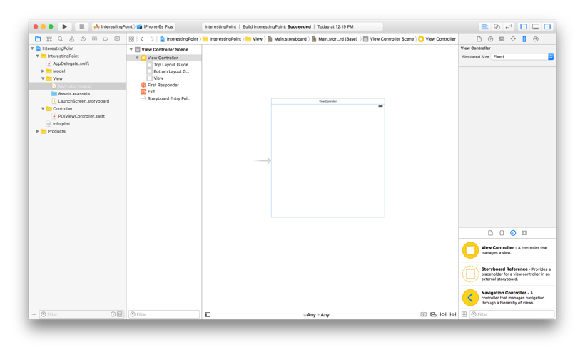

# Chapter I: Designing our application with xCode

### Introduction to Apple's *Integrated Development Environment*: xCode

> Xcode includes everything developers need to create great applications for Mac, iPhone, iPad, Apple TV, and Apple Watch. Xcode provides developers a unified workflow for user interface design, coding, testing, and debugging. The Xcode IDE combined with the Cocoa frameworks and Swift programming language make developing apps easier and more fun than ever before.

* Launch `xCode` and create a new project with the menu *File/New/Project...* or by using the shortcut <kbd>CMD</kbd> + <kbd>SHIFT</kbd> + <kbd>N</kbd>
* Select the *Single View Application* from the *iOS/Application* menu
* Set up your project in the next view:
  * Product Name: name your project 
  * Organization Name: name your organization
  * Organization Identifier: a prefix used to create a bundle identifier for your project
  * Language: select *Swift*
  * Devices: select *Universal*
  * Do not check *Use Core Data*, *Include Unit Tests* and *Include UI Tests*, we won't use them for this project

xCode will bootstrap a basic template template for you, the environment can be seperated between 4 areas:

* The *Toolbar* allow you to manage your IDE, run and stop applications
* The *Navigator area* provides your several type of navigator, the *Project Navigator* is the one you will be using mainly and represent your project architecture tree.
* The *Editor area* is the place where you write your code.
* The *Utility area* provides the inspectors (assistant to manage your file or get some informations) and the libraries.



### Cleaning up your project

The *project navigator* (in the navigator area) provides you a way to organize your project architecture. You can create folders and subfolders in your architecture tree and seperate your scripts as you wish. Let's start by seperating our files with the MVC pattern: <kbd>RIGHT CLICK</kbd> on the main folder in the *project navigator* and select the option "New Group" to create a new folder. Let's create 3 new folders: *Model*, *View* and *Controller*:

* Move the files *Main.storyboard*, *LaunchScreen.storyboard* and *Assets.xcassets* within your view folder
* Delete the default *ViewController.swift*
* Create a new file (<kbd>RIGHT CLICK</kbd> in the *project navigator* and select "New File...") *POIViewController.swift* in your *Controller* folder.



### Designing with the storyboard

It's time to design our application! We are going to use the built-in *Interface Builder*. Select your *Main.storyboard* file in your *project navigator*, the *Editor area* aspect has changed, you are actually in the *Interface Builder* of the storyboard. There are few things to notice about this interface:

* The *Document Outline* provides you the views hierarchy
* The *Editor area* is composed by 2 elements:
  * The graphic area where you can visualize your views application flow
  * A secondary toolbar where you can apply constraints and edit your default canvas



Did you notice the gray arrow pointing the *view controller*? This is the application *entry point*, it's the way xCode is telling you: "Hey, I will launch your application from here". There is other ways to set up the first view of your application, but xCode template is by default using the storyboard and its entry point.

The *entry point* can be attributed to any *view controller* of your storyboard checking `Is Initial View Controller` in the *Attributes inspector* (xCode will automatically delete the last entry point).

xCode also needs you to map the graphic view controller with its corresponding controller in your code. Let's create a new controller class in your *POIViewController.swift* file:

```swift
import UIKit

class POIViewController: UIViewController {
    
}
```

Notice that we set our *POIViewController* as a child of *UIViewController* so it inherits from all its characteristics. *UIViewController* is included in *UIKit*, that's why we import it at the begining of the file.

Once your saved your file, you can tell xCode that your *entry view controller* is a *POIViewController*. Go back to your *Main.storyboard* file, select the entry view controller and edit its class in the *Identity Inspector* to "POIViewController".

That's it, xCode will launch your application with this view controller as entry point, and it will be automatically mapped to your code in the *POIViewController class*.

Let's add some component to our *POIViewController*:

In the *Object Library*, select the *Map Kit View*`and <kbd>DRAG & DROP</kbd> it to the view controller. 

* Resize it to match the canvas
* Pin its *Trailing*, *Leading* and *Top* spaces to its superview
* Pin its *Bottom space* to the *Bottom Layout Guide*

You can pin a view by <kbd>RIGHT CLICKING</kbd> and dragging it to the view where you want to establish a constraint:



In the *Attributes inpector* of your map view, uncheck everything but the *Zooming*, *Scrolling* and *User Location* options.

Next add a *Table View* component to your view controller and set it up in the *View* panel of the *Size inspector:

* Show: Frame Rectangle
* X: 0
* Y: 300
* Width: 600
* Height: 300

And add the following constraints:

* Pin its *Trailing* and *Leading* spaces to its superview (the main view)
* Pin its *Bottom space* to the *Bottom Layout Guide*
* Pin its *Top* space* to the vertical center of the map view (in the *Size Inpesctor* of the constraint your should have Map View. Center Y - Equal - Table View.Top)

Finally (for this part) we are going to set up our *Table View Cells* using the storyboard. In the *Attributes Inspector* of the table view, set the  *Prototype Cells* number to *1* (this will create a prototype cell in the *graphic area*) and set the *Background* color of the *View* to *Clear Color* (which corresponds to transparent). In the *Size Inspector*, extend the height of the table view rows to *80*. Select the cell embedded in the table view, and set its *Background* color to *Clear Color* as well. Finish your design by selecting *Subtitle* for the *Style* of your table view cell (in the *Attributes Inspector*) this will add two labels "Title" and "Subtitle" to the cell content.

xCode should be warning you that any prototype cell must have reuse identifier. It must be set in the *Attributes Inspector*, set the *Identifier* value to "poiCell".

That's it. Congratulation! You designed the main view of your application with almost no code thanks to the hard work of the Apple developers!

The following screenshot is my *Document Outline* at this state:



At this point, if you run the application, you should have a crash.. don't worry, we will deal with it in the next chapter.