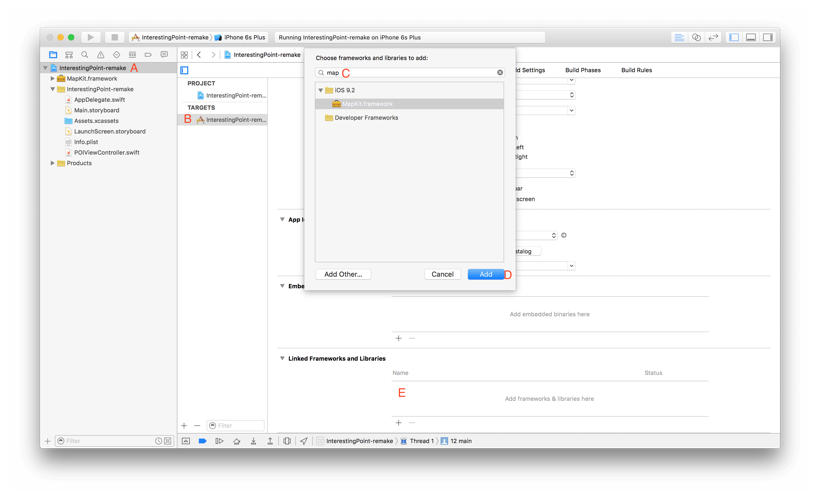
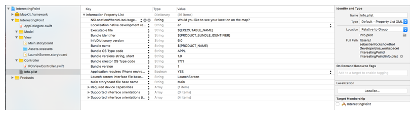
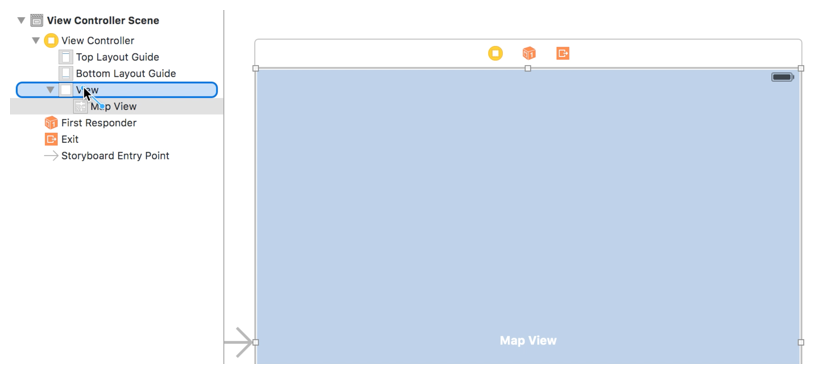
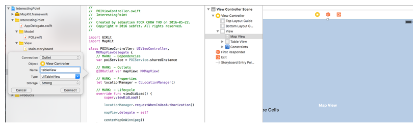

# Chapter II: Implementing the main view of your application

### Additional requirement for the built-in map view

At this point, if you are running the application, xCode should be reporting the following error:

> Terminating app due to uncaught exception 'NSInvalidUnarchiveOperationException', reason: 'Could not instantiate class named MKMapView'

This error reminds you that the *Interface Builder* is not fully doing the work while dragging a map view component within a graphic view controller of your storyboard. Indeed, you also need to link the *MapKit.framework* to your controller, you can do this can be done in the *General* pannel of your project:

* Select your project in the *Project Navigator*
* Select the target of your project
* In the *Linked Frameworks and Libraries* search and add the *MapKit* framework.



It leads you to a second error (which does not actually crash your application):

> Trying to start MapKit location updates without prompting for location authorization. Must call -[CLLocationManager requestWhenInUseAuthorization] or -[CLLocationManager requestAlwaysAuthorization] first.

Remember when you checked the *User Location* in the *Attributes Inspector* of the map view? That was a way to ask to xCode to manage the user location automatically. The problem is that xCode won't do all the job for you, you need to work with him to make this feature available.

Let's start by adding the basic method of any view controller to your *POIViewController*, `viewDidLoad()`:

```swift
import UIKit

class POIViewController: UIViewController {
    // MARK: - Lifecycle
    override func viewDidLoad() {
        super.viewDidLoad()
    }
}
```

`viewDidLoad()` is automatically called when your view controller has been... loaded. This is where you will put your code usually.

The error reported by xCode ask you to implement the method `requestWhenInUseAuthorization` (or `requestAlwaysAuthorization`). These methods can be called from a *CLLocationManager* of the *MapKit*. The difference between the two methods is that the first one tell the user you are going to use his/her device GPS feature only when the application state is *active* while the second one will ask for the feature even when the application is in the *background*. For the purpose of this tutorial, we only need to run the GPS when the application is *active*.

To be able to use the *MapKit* component, ou need to import the library at the top of your file, just under the *UIKit* import:

```swift
import UIKit
import MapKit
```

Then, you have to declare an instance of *CLLocationManager* and use this instance to call the required method:

```swift
class POIViewController: UIViewController {
    // MARK: - Properties
    let locationManager = CLLocationManager()

    // MARK: - Lifecycle
    override func viewDidLoad() {
        super.viewDidLoad()
        locationManager.requestWhenInUseAuthorization()
    }
}
```

But this is not enough. This is due to Apple'culture which require that you inform the user about what you are going to do through your application (especially when you are using personal data such as GPS location). By doing some search in the documentation, you will find the following:

> NSLocationWhenInUseUsageDescription

> NSLocationWhenInUseUsageDescription (String - iOS) describes the reason why the app accesses the user’s location normally while running in the foreground. Include this key when your app uses location services to track the user’s current location directly. This key does not support using location services to monitor regions or monitor the user’s location using the significant location change service. The system includes the value of this key in the alert panel displayed to the user when requesting permission to use location services.

> This key is required when you use the requestWhenInUseAuthorization method of the CLLocationManager class to request authorization for location services. If the key is not present when you call the requestWhenInUseAuthorization method without including this key, the system ignores your request.

> This key is supported in iOS 8.0 and later. If your Info.plist file includes both this key and the NSLocationUsageDescription key, the system uses this key and ignores the NSLocationUsageDescription key.

So you need to add this key-value to your *Info.plist* file and add a new entry *NSLocationWhenInUseUsageDescription* with a **String** type and write the message you want to display to inform the user about the GPS usage:



Run the application and accept the request for using your GPS, you should now be able to see your position on the map (At this state, your application has an invisible table view on the bottom part of your map)

### Setting up your map view

We want to connect our "graphic" map view with our controller, here again xCode will help us to make it easier. Switch to the *Assistant Editor* mode; this mode separates the *Code Editor* between 2 distinct editors. The trick here is to display your *Main.storyboard* in one side and your view controller in the other side (you can select the file you want to display in each view by navigating in the top bar). Once you did this, <kbd>CTRL</kbd> + <kbd>DRAG AND DROP</kbd> the map view component from your storyboard to your view controller implementation, just under the class declaration:



This will generate a popup for creating a reference of the element in your implementation, select the following options:

* Connection: Outlet
* Name: mapView
* Type: MKMapView
* Storage: Strong

You now have access to your map view, that means you can configure it as you wish. Apple provides *delegate pattern* for managing component such as your map view. Delegating with iOS is really simple:

* Define a delegate for your component (usually we choose the current view controller)
* Your delegate must register for the corresponding protocol
* Implement the required methods of the protocol

For your map view, do the following:

* In your `viewDidLoad()`, define the current controller as the delegate of your mapView: `mapView.delegate = self`
* Register your *POIViewController* to the *MKMapViewDelegate* protocol by adding it right after its declaration
* Implement the required method (luckily, *MKMapViewDelegate* protocol has only optional methods that we will implement later)

```swift
class POIViewController: UIViewController, MKMapViewDelegate {
    // MARK: - Outlets
    @IBOutlet var mapView: MKMapView!

    // MARK: - Properties
    let locationManager = CLLocationManager()

    // MARK: - Lifecycle
    override func viewDidLoad() {
        super.viewDidLoad()
        locationManager.requestWhenInUseAuthorization()
        mapView.delegate = self
    }
}
```

Let's center our map view on Winnipeg! Create the following `centerMapOnWinnipeg()` method in your file and call it from your `viewDidLoad()`:

```swift
// MARK: - Lifecycle
override func viewDidLoad() {
    super.viewDidLoad()
    locationManager.requestWhenInUseAuthorization()
    mapView.delegate = self
    centerMapOnWinnipeg()
}

// MARK: - Helpers
func centerMapOnWinnipeg() {
    let winnipegCoord = CLLocationCoordinate2D(
        latitude: 49.8672610886807,
        longitude: -97.1576372488644
    )
    let viewRegion = MKCoordinateRegionMakeWithDistance(
        winnipegCoord,
        60000,
        60000
    )
    mapView.setRegion(viewRegion, animated: false)
}
```

`setRegion()` method takes a *MKCoordinateRegion* as input, we create it with its custom init method `MKCoordinateRegionMakeWithDistance` by defining:

* A *CLLocationCoordinate2D* which is a 2D coordinate
* A *CLLocationDistance* for the latitude distance to cover
* A *CLLocationDistance* for the longitude distance to cover

Here, we define the region of our map view on winnipeg, and we cover 6 kilometers aroung the coordinate.

### Defining our point of interest model

Your map view has been configured programmatically and visually, you are going to set up some pins on it, but first of all, let's define these pins object. Apple already prepared this work for you, they implemented the *MKAnnotation* protocol which is necessary for fisplaying pins on a map. In your *Model* folder, create a new file "POI.swift" and define your own custom pins which is implementing the *MKAnnotation* protocol:

```swift
import MapKit

class POI: NSObject, MKAnnotation {
    var title: String?
    var subtitle: String?
    var coordinate: CLLocationCoordinate2D
    init(
        title: String?,
        subtitle: String?,
        coordinate: CLLocationCoordinate2D)
    {
        self.title = title
        self.subtitle = subtitle
        self.coordinate = coordinate
    }
}
```

POI is an *NSObject*, according to the documentation:

> NSObject is the root class of most Objective-C class hierarchies. Through NSObject, objects inherit a basic interface to the runtime system and the ability to behave as Objective-C objects.

It also register for the *MKAnnotation* protocol, once again, the documentation define this protocol with a *CLLocationCoordinate2D* coordinate and two optional *String* title and subtitle, all accessible.

Our *POI* class define the optional title and subtitle inherited from the *MKAnnotation* protocol but also its coordinate. And we create an basic initializer for the class.

That's it, we have a custom class which can be used as pins for our map view.

### Defining a persistent service providing our points of interest

Now that we have defined our map pins model, we could implement the code to create them and add them to the map, but the good practice is to use a persistent storage such as local database ([Core Data](https://developer.apple.com/library/mac/documentation/Cocoa/Reference/CoreData_ObjC/), [Realm](https://realm.io/), [SQlite](https://www.sqlite.org/), etc.), remote database with an API, and many other ways. In our case, we are going to simulate a service with the Singleton pattern.

Add a new folder *Service* in your *Project Navigator* and create a new file *POIService.swift*:

```swift
import CoreLocation

class POIService {
    static let sharedInstance = POIService()
    lazy var pointsOfInterest: Array<POI> = {
        return [
            POI(
                title: "First interesting place.",
                subtitle: "This place is great",
                coordinate: CLLocationCoordinate2D(
                    latitude: 49.8519574378154,
                    longitude: -97.2117918551222
                )
            ),
            POI(
                title: "Second interesting place.",
                subtitle: "This place is alright",
                coordinate: CLLocationCoordinate2D(
                    latitude: 49.9040656356851,
                    longitude: -97.1168358331907
                )
            ),
            POI(
                title: "Third interesting place.",
                subtitle: "This place sucks",
                coordinate: CLLocationCoordinate2D(
                    latitude: 49.9508672072522,
                    longitude: -97.2422074558971
                )
            ),
            POI(
                title: "Fourth interesting place.",
                subtitle: "Have I been here before?",
                coordinate: CLLocationCoordinate2D(
                    latitude: 49.8716259581715,
                    longitude: -97.0682061864028
                )
            ),
            POI(
                title: "Fifth interesting place.",
                subtitle: "I don't know where I am...",
                coordinate: CLLocationCoordinate2D(
                    latitude: 49.8141108489216,
                    longitude: -97.1298990909147
                )
            )
        ]
    }()
}
```

The *static* keyword here define a *class* property or method (against the usual *instance* property or method), that allows us to always access to the same property any time we call it.

Did you notice the *lazy* keyword? This attribute is supported by swift to improve your memory management. By using it, you ask xCode to process your code on-demand.

We can now inject this service dependency in our *POIViewController*:

```swift
class POIViewController: UIViewController, MKMapViewDelegate {
    // MARK: - Dependencies
    var poiService = POIService.sharedInstance
    [...]
}
```

At this state, your application display a map view which is centered on Winnipeg, it also provides a table view which is invisible and empty and finally it provides a persistent array with 5 points of interest. In the next step, we are going to use the *POIService* to fill the table view.

### Setting up your table view

Just like you connected your map view from your storyboard to your *POIViewController* implementation, connect your table view:



The built-in table view is similar to the map view: it use the *delegate pattern* and require a delegate and datasource. Set your *POIViewController* as both of them:

```swift
class POIViewController: UIViewController, MKMapViewDelegate, UITableViewDataSource, UITableViewDelegate {
	override func viewDidLoad() {
	    super.viewDidLoad()
	    // Do any additional setup after loading the view.
	    locationManager.requestWhenInUseAuthorization()
	    mapView.delegate = self
	    centerMapOnWinnipeg()
	    setupTableView()
	}
	func setupTableView() {
	    tableView.delegate = self
	    tableView.dataSource = self
	    // Blur tableView background (optional)
	    let visualEffect = UIBlurEffect(style: .Light)
	    let visualEffectView = UIVisualEffectView(effect: visualEffect)
	    tableView.backgroundView = visualEffectView
	}
}
```

The *UITableViewDatasource* protocol has 2 required methods you have to implement in your code (otherwise you won't even be able to compile the package): `tableView(tableView: UITableView, numberOfRowsInSection section: Int)` and `tableView(tableView: UITableView, cellForRowAtIndexPath indexPath: NSIndexPath) -> UITableViewCell`.

The first one define the number of rows required for each section, in our case we have only one section and we will display as many rows as our service is providing:

```swift
func tableView(tableView: UITableView, numberOfRowsInSection section: Int) -> Int {
    return poiService.pointsOfInterest.count
}
```

The second method define the content of each row.

If you followed the first part of this tutorial, xCode was complaining when we created a prototyped cell in the storyboard. the warning was telling us that every prototype cell must have its own identifier, so we gave the "poiCell" identifier without getting more information it.

Well, Apple implemented a system to improve the memory management of its devices. By using identifiers, every cell of a table view can be recycled when the cell is leaving the screen (so when you are scrolling the table view), we will define our row cell as *UITableViewCell* with the identifier we defined for our prototype cell:

```swift
func tableView(tableView: UITableView, cellForRowAtIndexPath indexPath: NSIndexPath) -> UITableViewCell {
    let cell = tableView.dequeueReusableCellWithIdentifier("poiCell", forIndexPath: indexPath)
    let poi = poiService.pointsOfInterest[indexPath.row]
    cell.textLabel?.text = poi.title
    cell.detailTextLabel?.text = poi.subtitle
    return cell
}
```

Run your application, the table view is now displaying the 5 point of interests:


### Displaying the pins on the map

So now that the *POIService* is providing *POI data* and the table view list them, we want our map view to show them as well.

Create a method `displayPOIAnnotationsOnMap()` which is displaying the element of our *POIService.sharedInstance* as annotations on the map and call it in your *viewDidLoad()`:

```swift
// MARK: - Lifecycle
override func viewDidLoad() {
    super.viewDidLoad()
    locationManager.requestWhenInUseAuthorization()
    mapView.delegate = self
    centerMapOnWinnipeg()
    setupTableView()
    displayPOIAnnotationsOnMap()
}

func displayPOIAnnotationsOnMap() {
    // Get POIs
    let pois = poiService.pointsOfInterest
    // Add annotations to map
    mapView.showAnnotations(pois, animated: true)
}
```

If you run the application, you will notice that our map view is centering on Winnipeg but without taking in consideration the part of the screen hidden by the table view. We can fix this by adding a bottom margin to our map view:

```swift
// MARK: - Lifecycle
override func viewDidLoad() {
    super.viewDidLoad()
    [...]
    displayPOIAnnotationsOnMap()
    setupMapView()
}

func setupMapView() {
	mapView.layoutMargins.bottom = tableView.frame.height
}
```

Now, you can see that the centering animation isn't really smooth. This is because we are running all our methods in the `viewDidLoad()` method. When we call `centerMapOnWinnipeg()` the map is actually centering itself on Winnipeg, then `displayPOIAnnotationsOnMap()` is positioning the map to provide a maximum of point of the array provided and finally `setupMapView()` is adding a bottom margin to our map view. The trick here is to delay our methods. We can call them from `viewDidAppear()` for example, to be sure that the animation occur when the view has been displayed:

```swift
// MARK: - Lifecycle
override func viewDidLoad() {
    super.viewDidLoad()
    locationManager.requestWhenInUseAuthorization()
    mapView.delegate = self
    centerMapOnWinnipeg()
    setupTableView()
}

override func viewDidAppear(animated: Bool) {
    super.viewDidAppear(animated)
    displayPOIAnnotationsOnMap()
    setupMapView()
}
```

### Synchronising the table view and the map view

If you play a little with your application, you will notice that something could be improved. The table view doesn't synchronize with your map view. The ideal case should be that both the table view and the pins on the map view call the same methods... well, we are going to implement this.

Actually when you click on a pin, the map view will be repositioned to be able to display the pin content. Well, since our *POIViewController* is delegating its own map view, let's implement the optional table view delegate `tableView(tableView: UITableView, didSelectRowAtIndexPath indexPath: NSIndexPath)`:

```swift
// MARK: - UITableViewDelegate
func tableView(tableView: UITableView, didSelectRowAtIndexPath indexPath: NSIndexPath) {
    let poi = poiService.pointsOfInterest[indexPath.row]
    mapView.selectAnnotation(poi, animated: true)
}
```

Every time we select a row in the table view, we identify the corresponding point of interest and we call `selectAnnotation()` on our map view to simulate a pin selection.

In the next chapter, you will learn how to pass your data in a detailled view where it can be updated.

Check out our code challenge [Improving UX with MKMap](part3/intro.md) before going on!