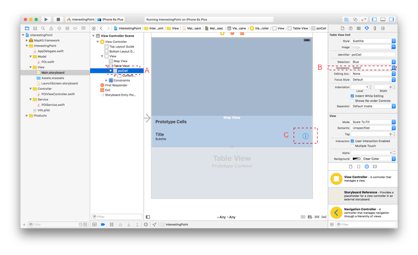
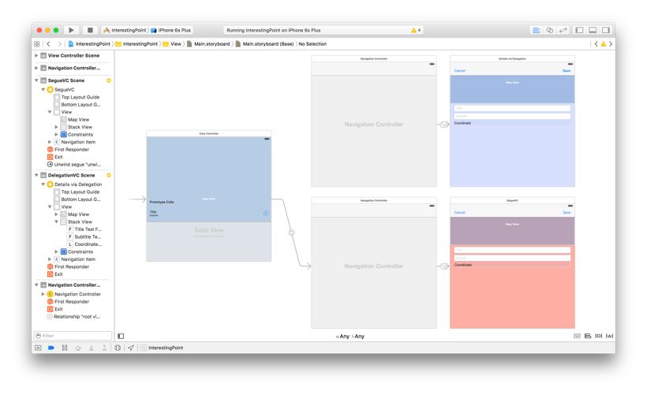

# Chapter III: Implementing a detailled view controller

### Designing a segue with the storyboard

We will now implement our detailled view controller. Let's start by adding a *Detail Accessory* to our cells, this is where the transition to the detailled view will start.

Go to the *Main.storyboard* file, select the *poiCell* prototype and set its *Accessory* field to "Detail" in the *Attributes Inspector*. This will automatically add a detail icon to the right of the table view cells.



Now it's time to design our detailled view. 

* Add a *Navigation Controller* component to your storyboard
* Delete its *Root View Controller* (it's by default a table view which is not what we want)
* Add a *View Controller* component to your storyboard
* <kbd>CTRL + DRAG</kbd> from your *Navigation Controller* to your *View Controller* and select the option "Relationship Segue: Root View Controller"
* Finally, <kbd>CTRL + DRAG</kbd> from your *poiCell* to your *Navigation Controller* and select the option "Accessory Action: Present Modally" (you are telling xCode that the Accessory from your *poiCell* should present the detailled view)

You just defined a segue connection in your storyboard. Select this segue (the connection between the main view and the new navigation controller) and rename it "showSegueVC" in the *Attributes Inspector*, this will help us to reference it in the code in the next part.

Let's add some design to our *detailled poi view*:

* Add a map view at the top of the view
  * Pin its trailing, leading and top spaces to the superview
  * Set its height equal to 200
* Add a vertical stack view under your map view (a stack view can manage a "stack of view" horizontally or vertically easily and prevent you from the pain of a "last edit constraint surgery")
  * In the *Attributes Inspector*, set its spacing to 8
  * Pin its trailing and leading spaces to the superview (the root view and not the map view)
  * Fix the vertical space between the map view and the stack view (default space should be 8)
* In the stack view, add 2 labels for the annotation title and subtitle and a label for its coordinate, all these component can be customized from the *Attributes Inspector* (for example, add a placeholder for the textfields)
* Finally add two *Bar Button Item* into the *Navigation Item* (by dragging them), one for each side (left and right). Rename the first one "Cancel" and the second one "Save" (they will be used for exiting this view)

That's it, from the storyboard, our detailled view has been set up. We now have to connect this new detailled view to our main view via the code.

### Connecting the new view

Let's create a view controller for our new detailled view. In your *controller* folder create a new file *SegueVC.swift*:

```swift
import UIKit

class SegueVC: UIViewController {
	
}
```

Once you defined your *SegueVC* controller, you can attribute it to the visual view controller in your storyboard (in the *Attributes Inspector*).

Once you did it, let's connect the four components to the code (Pass in *Assistant Editor* and drag and drop them to your controller just below the class declaration):

```swift
import UIKit
import MapKit

class SegueVC: UIViewController {
	@IBOutlet var mapView: MKMapView!
    @IBOutlet var titleTextField: UITextField!
    @IBOutlet var subtitleTextField: UITextField!
    @IBOutlet var coordinateLabel: UILabel!
}
```

We will configure 5 things in this controller:

```swift
class SegueVC: UIViewController, MKMapViewDelegate {
    // MARK: - Outlets
    @IBOutlet var mapView: MKMapView!
    @IBOutlet var titleTextField: UITextField!
    @IBOutlet var subtitleTextField: UITextField!
    @IBOutlet var coordinateLabel: UILabel!
    
    // MARK: - Properties
    var poi: POI!
    
    // MARK: - Lifecycle
    override func viewDidLoad() {
        super.viewDidLoad()
        
        validateDependencies()
        configureMapView()
        setLabels()
    }
    
    // MARK: - Helpers
    func validateDependencies() {
        guard poi != nil else {
            fatalError("\(self.dynamicType) did not meet poi dependency.")
        }
    }
    
    func configureMapView() {
        mapView.delegate = self
        mapView.showAnnotations([poi], animated: false)
    }
    
    func setLabels() {
        titleTextField.text = poi.title
        subtitleTextField.text = poi.subtitle
        coordinateLabel.text = "\(poi.coordinate.latitude), \(poi.coordinate.longitude)"
    }
}
```

* First, we create a *poi property* which will be the reference of the selected poi in the main view. In the `viewDidLoad()` we ensure that this property has been correctly set up (`validateDependencies()`).
* Second, we configure the map view, we set the controller as its delegate and we center it on the selected pin (using the delegate method `showAnnotations()`).
* Finally, we configure the two text fields and the label by giving them the values of the selected pin.

Our detailled controller has been implemented, we now need to configure the segue in the main controller, we can do this by using a method inherited by *UIViewController* `prepareForSegue(segue: UIStoryboardSegue, sender: AnyObject?)`:

```swift
// MARK: - Segues
override func prepareForSegue(segue: UIStoryboardSegue, sender: AnyObject?) {
    if segue.identifier == "showSegueVC" {
        let navController = segue.destinationViewController as! UINavigationController
        let segueVC = navController.topViewController as! SegueVC
        let selectedCell = sender as! UITableViewCell
        let selectedIndexPath = tableView.indexPathForCell(selectedCell)!
        
        let poi = poiService.pointsOfInterest[selectedIndexPath.row]
        segueVC.poi = poi
    }
}
```

To configure the *Navigation Button Item* proceed like this:

* In the *Assistant Editor* <kbd>CTRL + DRAG</kbd> your "Save" button to the bottom of the Class. In the popup, select the type *Action Connection* type and name it. This code will handle a pressure on the save button:

```swift
@IBAction func saveTapped(sender: AnyObject) {
    poi.title = self.titleTextField.text
    poi.subtitle = self.subtitleTextField.text
    
    // TODO: Set identifier in storyboard for unwind segue.
    performSegueWithIdentifier("unwindToPOIViewController", sender: self)
}
```

This action call a method from the root view controller `performSegueWithIdentifier()` which must:

* Be defined in the *POIViewController*:

```swift
@IBAction func unwindToPOIViewController(unwindSegue: UIStoryboardSegue) {
    if let segueVC = unwindSegue.sourceViewController as? SegueVC {
        let poi = segueVC.poi

        // We deselect and reselect the poi in case its content has been updated in the detailled view
        mapView.deselectAnnotation(poi, animated: false)
        mapView.selectAnnotation(poi, animated: false)
        
        // We reload the corresponding row in the table view in case it has been updated in the detailled view
        if let index = poiService.pointsOfInterest.indexOf(poi) {
            let indexPath = NSIndexPath(forRow: index, inSection: 0)
            tableView.reloadRowsAtIndexPaths([indexPath], withRowAnimation: .None)
        }
    }
}
```

* Have an identifier defined somewhere on the segues of your storyboards: select the segue in the storyboard and set it *Identifier* to "unwindToPOIViewController" in the *Attributes Inspector*

And don't forget to link this method to the "Cancel" bar button in the storyboard with <kbd>CTRL + DRAG</kbd> (for this manipulation, the <kbd>CTRL + DRAG</kbd> must be done from the *cancel button* to the *exit* at the top of the visual view controller and by selecting the corresponding method you previsously implemented).

### Delegation pattern

In this party, we will connect the *accessory contorl* of our pin on the map to the detailled view controller. The simpler way would be to connect it via the *segueVC* we implemented, but for the purpose of this tutorial we will implement another way to connect view controllers between them via the *delegation pattern*.

First of all, go to your *Main.storyboard* and create a new detailled view controller embedded in a *Navigation Controller* which is a copy of the one we did in the previous part (be sure to modify the background color of the background view in the *Attributes Inspector* so you can make the difference while running the application)



Implement the corresponding view controller: 

* Create a new swift file called *DelegationVC.swift*

```swift
class DelegationVC: UIViewController {

}
```

* Link your view controller in the storyboard to the new created class (in the *Identity Inspector*)
* Link the map, the two text fields and the label to your view controller (use the *Assistant Editor* and <kbd>CTRL + DRAG</kbd>)
* Link the navigation button bar to their action in your code (once again, using <kbd>CTRL + DRAG</kbd>)
* Finally add the basic needed methods we added to the SegueVC

```swift
class DelegationVC: UIViewController, MKMapViewDelegate {
    // MARK: - Outlets
    @IBOutlet var mapView: MKMapView!
    @IBOutlet var titleTextField: UITextField!
    @IBOutlet var subtitleTextField: UITextField!
    @IBOutlet var coordinateLabel: UILabel!
    
    // MARK: - Properties
    var poi: POI!
    
    // MARK: - Lifecycle
    override func viewDidLoad() {
        super.viewDidLoad()
        
        validateDependencies()
        configureMapView()
        setLabels()
    }
    
    // MARK: - Helpers
    func validateDependencies() {
        guard poi != nil else {
            fatalError("\(self.dynamicType) did not meet poi dependency.")
        }
    }
    func configureMapView() {
        mapView.delegate = self
        mapView.showAnnotations([poi], animated: false)
    }
    func setLabels() {
        titleTextField.text = poi.title
        subtitleTextField.text = poi.subtitle
        coordinateLabel.text = "\(poi.coordinate.latitude), \(poi.coordinate.longitude)"
    }
    
    // MARK: - Actions
    @IBAction func cancelTapped(sender: AnyObject) {
        // Exit the view
    }
    @IBAction func saveTapped(sender: AnyObject) {
        // Save values and exit the view
    }
}
```

We now need to define a delegate protocol which gonna create the relationship between the *POIViewController* and the *DelegateVC* (so we can inject the poi data). To define a protocol, use the *protocol* keyword, add the following code to the top of your *DelegationVC.swift* (just after the import statements):

```swift
protocol DelegationVCDelegate {
    func delegationVCDidCancel(delegationVC: DelegationVC)
    func delegationVCDidSave(delegationVC: DelegationVC)
}
```

This class now have its own protocol. Any class delegating an instance of our *DelegationVC* will have to implement its methods. Additionally, create a new property *delegate*. Any instance of *DelegationVC* must have its delegate:

```swift
var poi: POI!
// delegate definition
var delegate: DelegationVCDelegate!

[...]

func validateDependencies() {
    ...
    // delegate is required
    guard delegate != nil else {
        fatalError("\(self.dynamicType) did not meet delegate dependency.")
    }
}
```

And finally, we pass the delegation methods to our `cancelTapped()` and `saveTapped()` methods:

```swift
// MARK: - Actions
@IBAction func cancelTapped(sender: AnyObject) {
    delegate.delegationVCDidCancel(self)
}

@IBAction func saveTapped(sender: AnyObject) {
    poi.title = self.titleTextField.text
    poi.subtitle = self.subtitleTextField.text
    
    delegate.delegationVCDidSave(self)
}
```

That's it for this class. That was a lot of code, let summarize what we did:

* We designed the detailled view controller in the storyboard
* We defined a new controller *DelegationVC* and we associated it to the detailled view controller in the storyboard
* We connected the components of the view to our controller
* We configured the different element of the view in our controller lyfe cycle
* We implemented a protocol for our *DelegationVC* this protocol expose 2 methods `delegationVCDidCancel()` and `delegationVCDidSave()`
* The navigation button bar called the protocol method when tapped

We now have to create an instance of this new *DelegationVC* Class when a pin of our *POIViewController* is tapped.

In your *POIViewController*, add an information accessory to the pins of the map view:

```swift
// MARK: - MKMapViewDelegate
func mapView(mapView: MKMapView, viewForAnnotation annotation: MKAnnotation) -> MKAnnotationView? {
    // Return nil (default) for all annotations which are not POIs. i.e. MKUserLocation
    guard annotation is POI else { return nil }
    
    // Memory optimization
    let reuseIdentifier = "pinAnnotationView"
    let annotationView = mapView.dequeueReusableAnnotationViewWithIdentifier(reuseIdentifier) as? MKPinAnnotationView ??
        MKPinAnnotationView(annotation: annotation, reuseIdentifier: reuseIdentifier)
    annotationView.canShowCallout = true
    
    // Info Button
    let rightButton = UIButton(type: .DetailDisclosure)
    annotationView.rightCalloutAccessoryView = rightButton
    
    return annotationView
}
```

The *MKMapViewDelegate protocol* already includes a method for managing the event of tapping an accessory's pin, `mapView(mapView: MKMapView, annotationView view: MKAnnotationView, calloutAccessoryControlTapped control: UIControl)`:

```swift
func mapView(mapView: MKMapView, annotationView view: MKAnnotationView, calloutAccessoryControlTapped control: UIControl) {
    let poi = view.annotation as! POI
    
    // DelegationVC
    if control == view.rightCalloutAccessoryView {
        // Instantiate view controller from storyboard.
        let storyboard = UIStoryboard(name: "Main", bundle: nil )
        let navController = storyboard.instantiateViewControllerWithIdentifier(
            "DelegationNC") as! UINavigationController
        
        // TODO: Configure DelegationVC before presenting.
        let delegationVC = navController.topViewController as! DelegationVC
        
        delegationVC.poi = poi
        delegationVC.delegate = self
        
        // Present as modal
        presentViewController(navController, animated: true, completion: nil)
    }
}
```

and because your are setting the *POIViewController* as the delegate of your *DelegationVC* instance, don't forget to register for its protocol:

```swift
class POIViewController: UIViewController, MKMapViewDelegate, UITableViewDataSource, UITableViewDelegate, DelegationVCDelegate {
	[...]

	// MARK: DelegationVCDelegate
    func delegationVCDidCancel(delegationVC: DelegationVC) {
        dismissViewControllerAnimated(true, completion: nil)
    }
    func delegationVCDidSave(delegationVC: DelegationVC) {
        let poi = delegationVC.poi
        // MapView annotation
        mapView.deselectAnnotation(poi, animated: false)
        mapView.selectAnnotation(poi, animated: false)
        
        // TableView row
        if let index = poiService.pointsOfInterest.indexOf(poi) {
            let indexPath = NSIndexPath(forRow: index, inSection: 0)
            tableView.reloadRowsAtIndexPaths([indexPath], withRowAnimation: .None)
        }
        
        dismissViewControllerAnimated(true, completion: nil)
    }
}
```

We just implement them so they will pop the view from the pile when the cancel button of the *DelegateVC* is tapped, or save the reload the pin and its corresponding row if the save button has been tapped (because the value may have changed in this case).

### Showing direction

This additional part will be really simple but not less interesting. We will be adding a new *Accessory Control* to our pins, this new component will display the direction from the user location to the selected pin.

First, edit the `mapView(mapView: MKMapView, viewForAnnotation annotation: MKAnnotation)` and add the new *Accessory Control*:

```swift
func mapView(mapView: MKMapView, viewForAnnotation annotation: MKAnnotation) -> MKAnnotationView? {
    [...]
    
    // Directions Button
    let leftButton = UIButton(type: .Custom)
    let image = UIImage(named: "Car Icon")
    leftButton.setImage(image, forState: .Normal)
    leftButton.frame = CGRect(x: 0, y: 0, width: 50, height: 50)
    leftButton.tintColor = UIColor.whiteColor()
    leftButton.backgroundColor = self.view.tintColor
    annotationView.leftCalloutAccessoryView = leftButton
}
```

This code will create a left accessory view which is a square car icon. We will update the `mapView(mapView: MKMapView, annotationView view: MKAnnotationView, calloutAccessoryControlTapped control: UIControl)`, otherwise tapping the new accessory will just open the detailled view controller:

```swift
func mapView(mapView: MKMapView, annotationView view: MKAnnotationView, calloutAccessoryControlTapped control: UIControl) {
    let poi = view.annotation as! POI
    // Directions
    if control == view.leftCalloutAccessoryView {
        let placemark = MKPlacemark(
            coordinate: poi.coordinate,
            addressDictionary: nil
        )
        
        let mapItem = MKMapItem(placemark: placemark)
        mapItem.name = poi.title
        
        mapItem.openInMapsWithLaunchOptions([MKLaunchOptionsDirectionsModeKey: MKLaunchOptionsDirectionsModeDriving])
    }
    // DelegationVC
    [...]
}
```

That's it, to display a direction in iOS, you just need to create an instance of an MKMapItem which define the destination.

At this point, your application is running, you have a list a *POI* displayed on the map and in your tableview, and if tap the information buble, you will be redirected to a detailled view controller where you can update the *POI* informations and if you tap the car icon, you will be redirected to a direction map.


