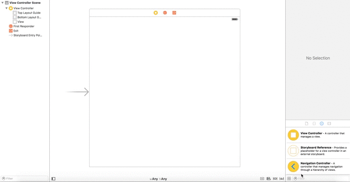
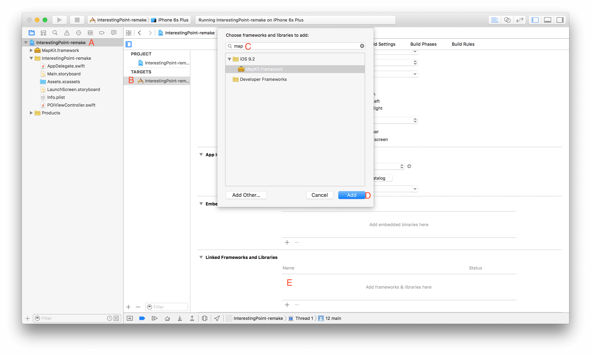
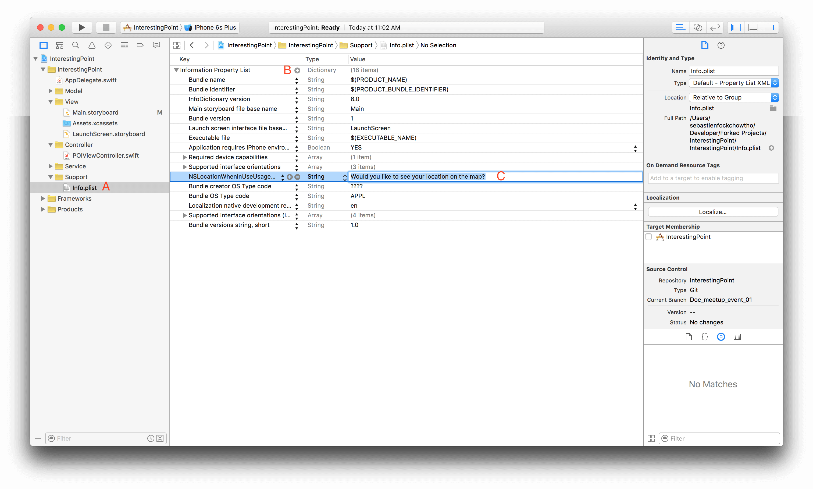

# Step 1: Layout Map UI in Interface Builder

Go to your project's storyboard, and add the `Map Kit View` to your `view controller` and constraint it. The storyboard provides you a simple way to add constraints to your component by <kbd>Ctrl</kbd> + dragging the component to the view, add the following constraints to your map view:

* Vertical spacing to top layout guide
* Vertical spacing to bottom layout guide
* Trailing space to container margin
* Leading space to container margin

The following is an illustration of this method:



Build and run your project... we get the following error:

> Terminating app due to uncaught exception 'NSInvalidUnarchiveOperationException', reason: 'Could not instantiate class named MKMapView'

This error from `xCode` remind you that the IB is not fully doing the work while dragging the `map view` component to our view controller, we need to link the `MapKit.framework` to enable our project to use the map features.



That's it, you get your map on your device!

Now we'd like to see our location on the map... go back to your storyboard, select your map view and check the `User Location` in the Utilities/Attribute Inspector. This will lead to our second error:

> Trying to start MapKit location updates without prompting for location authorization. Must call -[CLLocationManager requestWhenInUseAuthorization] or -[CLLocationManager requestAlwaysAuthorization] first.

This error is clear, we need to call the method `requestWhenInUseAuthorization` of the `CLLocationManager`, so let's do it, create an instance of `CLLocationManager` and call the required method: 

```swift
import UIKit
import MapKit

class POIViewController: UIViewController {    
    // MARK: - Outlets
    @IBOutlet weak var mapView: MKMapView!
    
    // MARK: - Properties
    let locationManager = CLLocationManager()

    // MARK: - Lifecycle
    
    override func viewDidLoad() {
        super.viewDidLoad()

        // Do any additional setup after loading the view.
        locationManager.requestWhenInUseAuthorization()
    }
}
```

But this is not enough. This is due to Apple'culture which require that you inform the user about what you are going to do through your application (especially when you are using personal data such as GPS location). By doing some search in the documentation, you will find the following:

> NSLocationWhenInUseUsageDescription

> NSLocationWhenInUseUsageDescription (String - iOS) describes the reason why the app accesses the user’s location normally while running in the foreground. Include this key when your app uses location services to track the user’s current location directly. This key does not support using location services to monitor regions or monitor the user’s location using the significant location change service. The system includes the value of this key in the alert panel displayed to the user when requesting permission to use location services.

> This key is required when you use the requestWhenInUseAuthorization method of the CLLocationManager class to request authorization for location services. If the key is not present when you call the requestWhenInUseAuthorization method without including this key, the system ignores your request.

> This key is supported in iOS 8.0 and later. If your Info.plist file includes both this key and the NSLocationUsageDescription key, the system uses this key and ignores the NSLocationUsageDescription key.

So you need to add this key-value to your `Info.plist` file and add a new entry `NSLocationWhenInUseUsageDescription` with a **String** type and write the message you want to display to inform the user about the GPS usage:



Finally, we want to center our map on Winnipeg region. It can be done by using the `setRegion()` method of `MK Map View` and passing your region as a `MKCoordinateRegionMakeWithDistance`:

```swift
let winnipegCoord = CLLocationCoordinate2D(
    latitude: 49.8672610886807,
    longitude: -97.1576372488644
)

let viewRegion = MKCoordinateRegionMakeWithDistance(
    winnipegCoord,
    60000,
    60000
)

mapView.setRegion(viewRegion, animated: false)
```