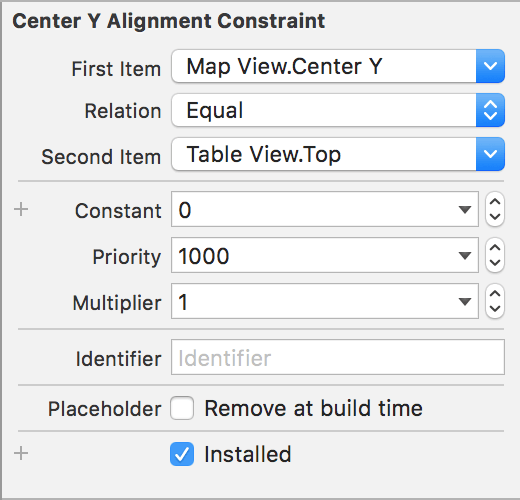

# Step 3: Add UITableView to UI in IB

This step is really short, we are going to add a `UITableView` over our `MK Map View` and make some customization.

Go to your **storyboard** and add the component `Table View` over your map view. Add the following constraints to the new table view:

* Vertical spacing to bottom layout guide
* Trailing space to container margin
* Leading space to container margin

If you don't remember how to do this, check back the [Step 1: Layout Map UI in Interface Builder](step1.md). Here we are adding a new type of constraint: the alignment.

<kbd>Ctrl</kbd> drag your mouse from the `table view` to the `map view` and select the option `Center vertically` and modify the option of the constraint to the following:



And don't forget to update the frame if needed (`xCode` will provide a warning in the **Document Outline** if necessary).

Also add the component `Table View Cell` to your `Table View` with 2 `UILabel` for the **title** and **subtitle**

Finally, we will customize our table view programmatically, add the following to your `POIViewController` within the `viewDidLoad` scope:

```swift
let visualEffect = UIBlurEffect(style: .Light)
let visualEffectView = UIVisualEffectView(effect: visualEffect)
tableView.backgroundView = visualEffectView
```

This is just a blur effect on the background of the table.