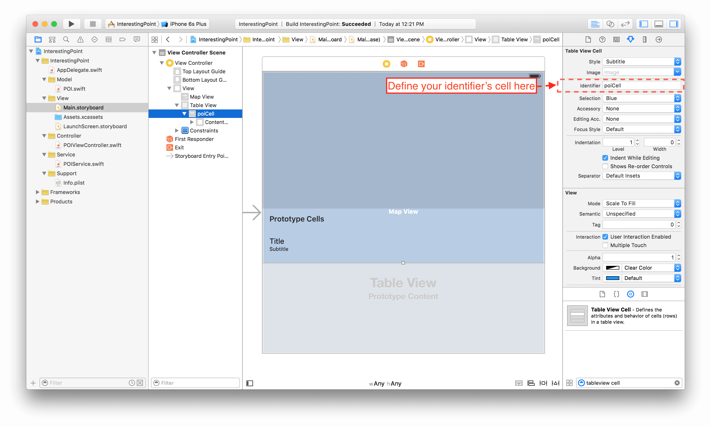
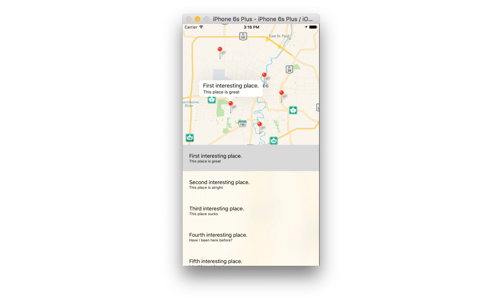

# Step 5: Show POIs in TableView

This is the most interesting part: we are going to use the `delegation` and `datasourcing` features of **iOS** in order to feed and control our components. 

You said `delegation` and `datasourcing`... what's this?

To make it simple, a Class can define a specific protocol with methods which are necessary (or sometimes optional) to control itself (such as feeding the cells of a table view, or opening the keyboard while clicking in my custom field, etc.). Any component can register to a protocol and implement its methods in order to manipulate the one (or more) instance(s) of the Class. 

What's more? Well, Apple already defined protocol for useful native Class in its libraries. Sounds great! Let's try it with the `Table View` component:

Any component can register to a protocol, but usually we will define the current view controller as the delegate and/or datasource for the instance which require it, let's define our `POIViewController` as a table view datasource and delegate (and this is -again- really simple):

```swift
class POIViewController: UIViewController, UITableViewDataSource, UITableViewDelegate {
    @IBOutlet weak var mapView: MKMapView!
    @IBOutlet weak var tableView: UITableView!

	override func viewDidLoad() {
        super.viewDidLoad()

        // Do any additional setup after loading the view.
        ...
        tableView.datasource = self		// <-- Don't forget to register the view controller as the datasource and delegate 
        tableView.delegate = self		// <-- of your table view instance
    }
}
```

That's it, your `POIViewController` can handle any instance of the `Table View` Class! But wait.. **xCode** is now giving me a new error:

> Type 'POIViewController' does not conform to protocol 'UITableViewDataSource'

Remember about required or optional protocol's methods to implement? Well `UITableViewDataSource` define some required methods in its protocol: `tableView(tableView: UITableView, numberOfRowsInSection section: Int)` and `tableView(tableView: UITableView, cellForRowAtIndexPath indexPath: NSIndexPath)`

The first one defines the number or row which must be inserted into our table view. In our case this should be equal to the number of POIs in our **pois array**, add the following to your `POIViewController`:

```swift
func tableView(tableView: UITableView, numberOfRowsInSection section: Int) -> Int {
    return poiService.pointsOfInterest.count
}
```

The second method defines the design of our cells (which is important and we understand why it is a required method of the protocol), in our case we already "draw" a custom cell with a **title** and **subtitle** in our storyboard remember? Go back to your storyboard and add an identifier to your custom cell in order to point it in your code:



We can now refer to this custom cell with the identifier "poiCell" in our code:

```swift
func tableView(tableView: UITableView, cellForRowAtIndexPath indexPath: NSIndexPath) -> UITableViewCell {
    let cell = tableView.dequeueReusableCellWithIdentifier("poiCell", forIndexPath: indexPath)
    
    let poi = poiService.pointsOfInterest[indexPath.row]
    
    cell.textLabel?.text = poi.title
    cell.detailTextLabel?.text = poi.subtitle
    
    return cell
}
```

* We refer to our custom cell in the storyboard
* We bind the value of each element of the **pois array** to our cell's components

But the **table view** protocol is much more powerful, Apple's developers defined tons of methods you can implement to customize your table view. We can for example, define the event when a cell of the **table view** is selected through the `tableView(tableView: UITableView, didSelectRowAtIndexPath indexPath: NSIndexPath)` delegate method:

```swift
func tableView(tableView: UITableView, didSelectRowAtIndexPath indexPath: NSIndexPath)
{
    NSLog("The cell at this index \(indexPath.row) has been selected!")
}
```

This is awesome! We can even combine the protocol's method of the **table view** delegate and the **map view** delegate:

```swift
import UIKit
import MapKit

class POIViewController: UIViewController, UITableViewDataSource, UITableViewDelegate, MKMapViewDelegate {    // <- map view delegation protocol
    @IBOutlet weak var mapView: MKMapView!
    @IBOutlet weak var tableView: UITableView!
 	...   

    // MARK: - Lifecycle
    
    override func viewDidLoad() {
        super.viewDidLoad()

        // Do any additional setup after loading the view.
        mapView.delegate = self		// <-- map view delegate
        ...
    }
    
    override func viewDidAppear(animated: Bool) {
        super.viewDidAppear(animated)
        
        ...
    }

    // MARK: - UITableViewDataSource
    
    func tableView(tableView: UITableView, numberOfRowsInSection section: Int) -> Int {
        return poiService.pointsOfInterest.count
    }
    
    func tableView(tableView: UITableView, cellForRowAtIndexPath indexPath: NSIndexPath) -> UITableViewCell {
        ...
    }
    
    // MARK: - UITableViewDelegate
    
    func tableView(tableView: UITableView, didSelectRowAtIndexPath indexPath: NSIndexPath)
    {
        let poi = poiService.pointsOfInterest[indexPath.row]
        mapView.selectAnnotation(poi, animated: true)	<-- Our controller can now interact with the map view through the delegate's methods
    }
}
```

And we can even do it in the other way, selecting the corresponding line in our **table view** while touching one of the POI on the map:

```swift
func mapView(mapView: MKMapView, didSelectAnnotationView view: MKAnnotationView) {
    // The annotation of the selected POI can be nil by definition, because it's an optional
    // So we check if it's value exist through the guard statement
    guard let selectedPOI = view.annotation as? POI else {
        print("\(__FUNCTION__): Could not get POI from annotationView.")
        return
    }
    
    // Same here
    guard let index = poiService.pointsOfInterest.indexOf(selectedPOI) else {
        print("\(__FUNCTION__): Could not get index of selected POI")
        return
    }

    // We select the coressponding cell
    let indexPath = NSIndexPath(forRow: index, inSection: 0)
    tableView.selectRowAtIndexPath(indexPath, animated: true, scrollPosition: .Top)
}
```

Build and run.. your application is running like a charm! 



You have learnt some basics about the Interface Builder, how to manage the constraints of your components in your view, how to use the delegation and datasourcing protocol of a Class. Check out the [Code challenge of this first meetup](../part3/intro.md) And don't miss [the tips from Jeffrey during the presentation](../part2/snippets.md)