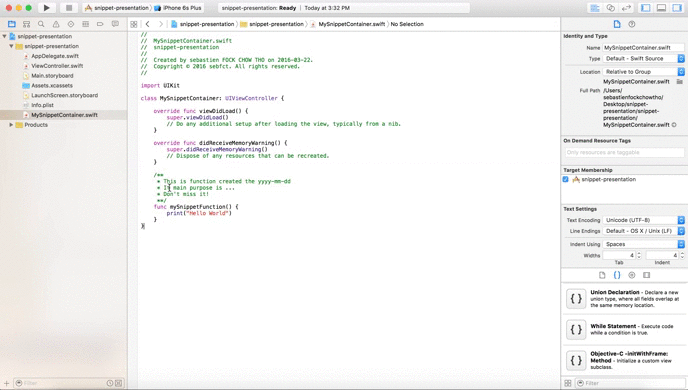

# How to use snippets with xCode

[Jeffrey](http://www.meetup.com/Winnipeg-iOS-Developers/members/52765062/) has introduced the art of snipping with **xCode** during his presentation. This feature allow you to save and alias any content in your code in order to reproduce it later, this is really powerful and can help you to handle a presentation for example (saving you the time to switch between your **already did at home** and the **in progress presentation** code), and thanks to Apple's developers it's really simple to use:

1. Select the code you want to set as snippet
2. Open the `Code Snippet Library`
3. Drag the selected code to the `Code Snippet Library`
4. Edit the created snippet and add a `Completion shortcut`
5. Start typing your shortcut anywhere in your code and xCode will display the snippet

The following is an illustration of these steps:

