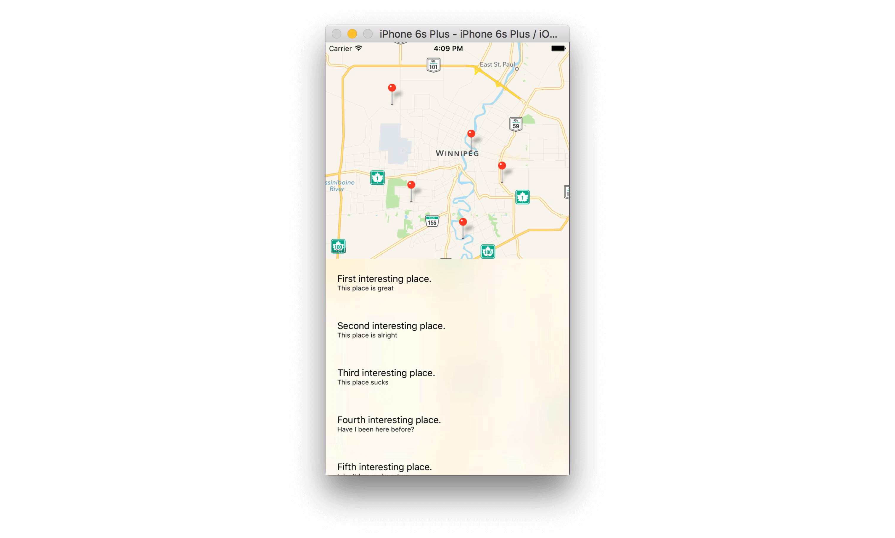

# Code Challenge!

[Jeffrey](http://www.meetup.com/Winnipeg-iOS-Developers/members/52765062/)'s presentation covered how to manage your view controller to display a `MK Map View` and a `Table View`, we have also seen how making them interact through the **delegation** and **datasourcing** methods.

In this code challenge, you will resolve the issue our first user has met with InterestingPoint Project: he sent us the following email:

> Dear Winnipeg iOS Developer, I downloaded, installed and tried your new application one week ago. I was quite busy these days and gave it a real try only yesterday. But while running the application, unfortunately, I can't even see my own location on the map and that make it painful when I want to reach one of your points of interest... that would be awesome if you could fix it! Please find enclosed the screenshot from my device:

Try to understand what happened to this user and solve this issue by being sure that no more user will report it in the future.

Download the source code of the project [here](https://github.com/Winnipeg-iOS-Developers/InterestingPoint/archive/master.zip)

###### Hints

We reported our issue on [Stack Overflow](http://stackoverflow.com/) and got some quick answers:

* Answer 1:

> Did you guys forget to use the `requestWhenInUseAuthorization()` of your `CLLocationManager` instance? Apple require to inform the user about every feature of their device your want to use. Also, do not forget to add the corresponding key/value to your `Info.plist` file...

* Answer 2:

> Hey there! Did you ask the user whether he accepted or refused or allowed your application using its GPS? If he refused, the application won't be able to display its location. I did a similar work few months ago and I used a protocol method of the `CLLocationManager` to check the state the authorization state...

Hoping it will help you to find a solution, Good luck!