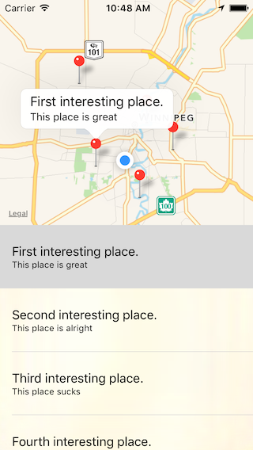

# InterestingPoint

A location-based app written in Swift 2.0 for iOS 9 as part of a beginners series for The Winnipeg iOS Developers meetup group.

__*NOTE*__: The following steps are not meant to be a full tutorial as I'm lazy and not going to put that much time in... These are simply my presentation notes which require a fair amount of iOS/Xcode knowledge to follow. I will gladly accept any pull request updating this to a proper tutorial. :)

## Part 1: Getting started

### What our App will do:
- Display Points Of Interest (POI) as both pins on a map and list items in a table.
- Selecting a POI in the table will highlight the corresponding pin on the map.
- Selecting a pin on the map will highlight the corresponding POI in the table.

### Step 1: Layout Map UI in IB:
(git tag 1.0) (starting point)
- Add MapView and constraints to POIViewController in main storyboard. Build and run, doesn't work, inspect console error.
- Link MapKit.framework by enabling Maps capability in Project -> Capabilities.
- Enable mapView's 'User Location' in IB; doesn't work, inspect console error.
- Add CLLocationManager to POIViewController and call requestWhenInUseAuth().
- Still fails... check StackOverflow and Apple documentation.
- Add NSLocationWhenInUseUsageDescription to Info.plist.
- Center map on Winnipeg in viewDidLoad.

### Step 2: Show Pins on the Map:
(git tag 2.0)
- Add displayPOIAnnotationsOnMap function and call from viewDidAppear().
- Add MKAnnotation conformance to POI and refactor displayPOIAnnotationsOnMap accordingly.

### Step 3: Add UITableView to UI in IB:
(git tag 3.0)
- Add UITableView over MapView.
- Blur tableView background in setupTableView()

### Step 4: Update MapView's Visible Region:
(git tag 4.0)
- Map center should be center of visible region rather than center of screen.
- Set mapView's bottom layout margin to tableView height in setupMapView().

### Step 5: Show POIs in TableView:
(git tag 5.0)
- Set POIViewController as tableView's datasource and delegate.
- Implement tableView's numberOfRows... and cellForRow... functions.
- Select associated mapView annotation on tableView.didSelectRow...
- Set POIViewController as mapView's delegate.
- Select associated tableView row on mapView.didSelectAnnotation...